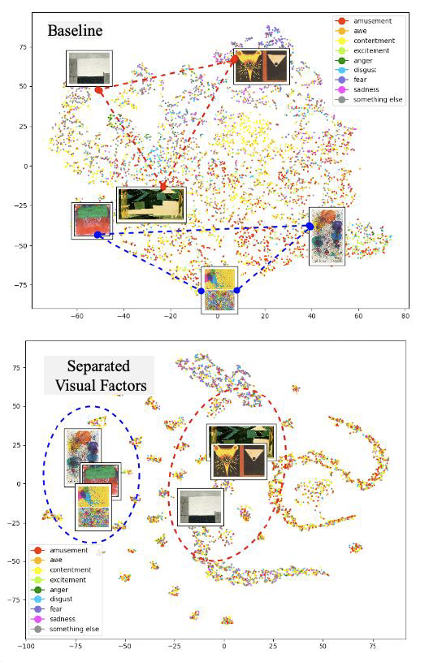

<h3 align="center">Finding Visual Factors of Human Emotional Appreciation to Abstract Paintings</h3>

Modern abstract painters explored how the art principles, such as shape, line, color, or light, affect our visual experience. This project aims to reveal the factors that might influence human emotional experience to abstract art from a machine’s perspective. Inspired by bottom-up and top-down processes presented in the book, "Reductionism in Art and Brain Science", a machine learning system is designed to simulate the two directional braiin processes on the way to final emotional recognition for abstract paintings. Semantic interpretation of the found discrete space on the bottom-up part will find the  key visual factors. 
The code is developed based on the emotional classifier of artemis. 

<figure style="width: 100%; font-style: itlaic; font-size: smaller text-align: left;">
 
<figcaption> Current Results: A new emotional classifier (prototype model) is developed (bottom figure), which generates discrete clusters according to a finite set of visual factors, while the baseline system (top figure) is a continuous and entangled for semantic interpretion. We was able to confirm the common visual factors for each cluster. For example, the blue-circled cluster could be described by primary colors or amorphous shape. On the other hand, the red circle samples could be described by low-saturated color and geometric shapes.</figcaption>
</figure>

